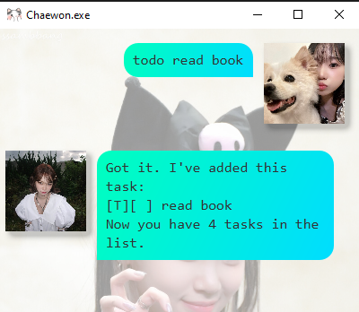
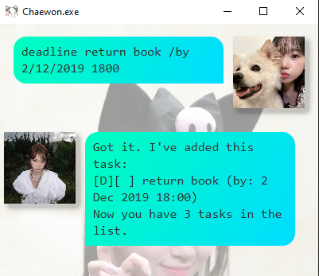
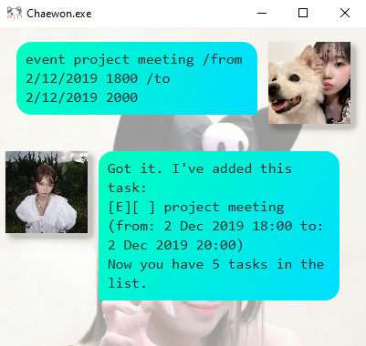

# Chaewon User Guide (CS2103T) 😺

[Link to user guide](https://bipplane.github.io/ip/)

This is my very own individual software project, featuring a chatbot named after the absolute **BADDIE** known as Kim Chaewon! I will be dedicating my efforts towards this project throughout AY24/25 Semester 2 to develop the essential skills needed in the expansive field of software engineering. WIZ*ONE FOREVER!!
  

 Winky face! 😉 

## Setting up in IntelliJ

**Prerequisites:** JDK 17, update IntelliJ to the most recent version.

1. Open IntelliJ (if you are not in the welcome screen, click `File` > `Close Project` to close the existing project first).
2. Open the project into IntelliJ as follows:
   1. Click `Open`.
   2. Select the project directory, and click `OK`.
   3. If there are any further prompts, accept the defaults.
3. Configure the project to use **JDK 17** (not other versions) as explained in [here](https://www.jetbrains.com/help/idea/sdk.html#set-up-jdk). 
   In the same dialog, set the **Project language level** field to the `SDK default` option.
4. After that, locate the `src/main/java/chaewon/Chaewon.java` file, right-click it, and choose `Run Chaewon.main()` (if the code editor is showing compile errors, try restarting the IDE). If the setup is correct, you should see something like the below as the output:

**Warning:** Keep the `src\main\java` folder as the root folder for Java files (i.e., don't rename those folders or move Java files to another folder outside of this folder path), as this is the default location some tools (e.g., Gradle) expect to find Java files.

## Quick Start

Getting Started:
1. Download the application from [here](https://github.com/bipplane/ip/).
2. Run the executable.
3. Add your tasks and let Chaewon manage them!

## Adding todo tasks

To add a todo task, use the `todo` command.

For example: `todo read book`

## Adding deadlines

To add a deadline, use the `deadline` command.

For example: `deadline return book /by 2/12/2019 1800`

## Adding events

To add an event, use the `event` command.

For example: `event project meeting /from 2/12/2019 1800 /to 2/12/2019 2000`

## Other features

More commands include `list`, `done`, `delete`, `find`, and `bye`. Give them a try!