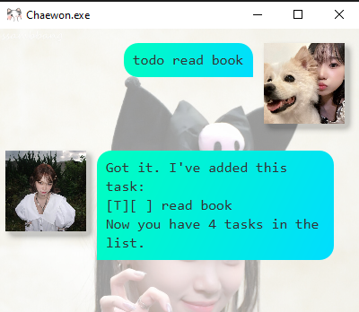
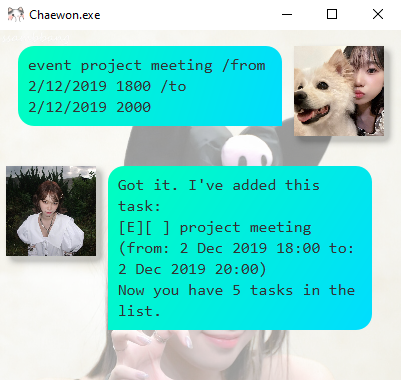

# Chaewon User Guide

Chaewon is a desktop app for managing tasks, optimised for use via a Command Line Interface (CLI). 
If you can type fast, Chaewon can help you manage your tasks faster than traditional GUI apps.

## Quick Start

Getting Started:
1.  Download the application from [here](https://github.com/bipplane/ip/).  
2.  Run the executable.  
3.  Add your tasks and let Chaewon manage them!  

## Adding todo tasks

To add a todo task, use the `todo` command.

For example: `todo read book`

## Adding deadlines

To add a deadline, use the `deadline` command. 

For example: `deadline return book /by 2/12/2019 1800`

## Adding events

To add an event, use the `event` command.

For example: `event project meeting /from 2/12/2019 1800 /to 2/12/2019 2000`

## Other features
More commands include `list`, `done`, `delete`, `find`, and `bye`. Give them a try!